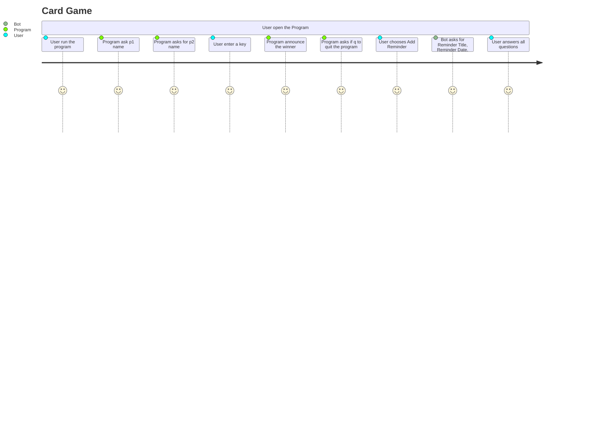

# Card Game Overview
 Class Cards
 The Card class, which has two class variables, suits and values, is the first class in our card game written in Python. Spades, hearts, diamonds, and clubs are just a few of the possible suits represented by the tuple of strings known as "suits." value is a tuple of strings that represents the range of possible card values, from 2 to 10, as well as Jack, Queen, King, and Ace.
 
## Instructions
 1. Each player draws a card from the deck.
 2. after drawing the cars the program will process the card that was drawn.
 3. After processing the player with the highest card will win.
 
 ### UML Diagram

